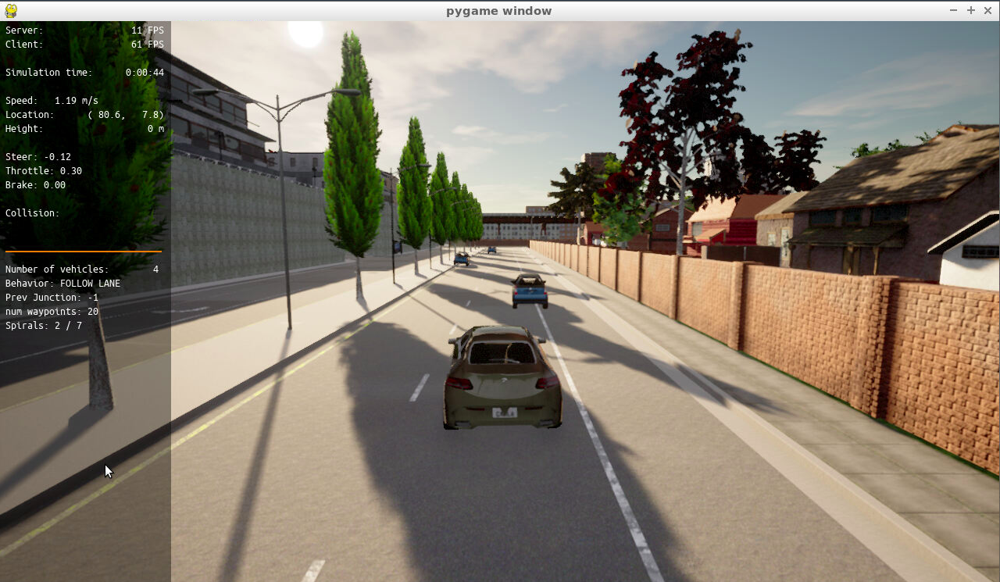
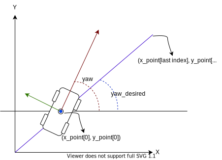
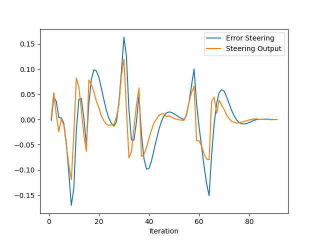
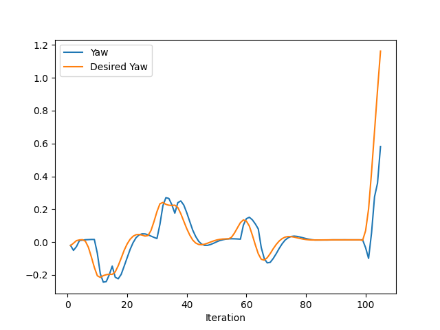
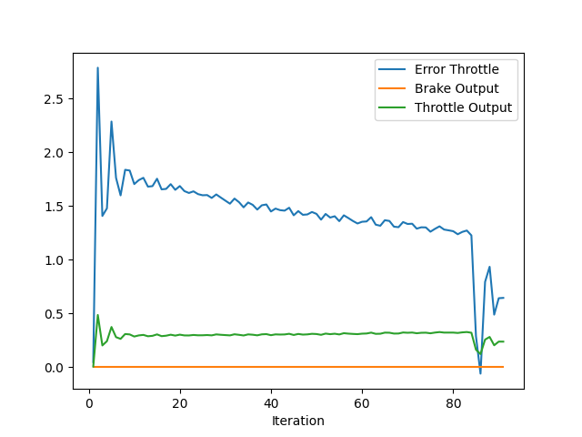
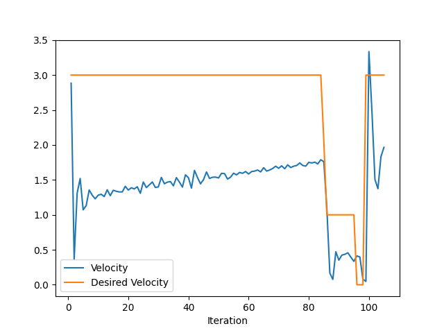
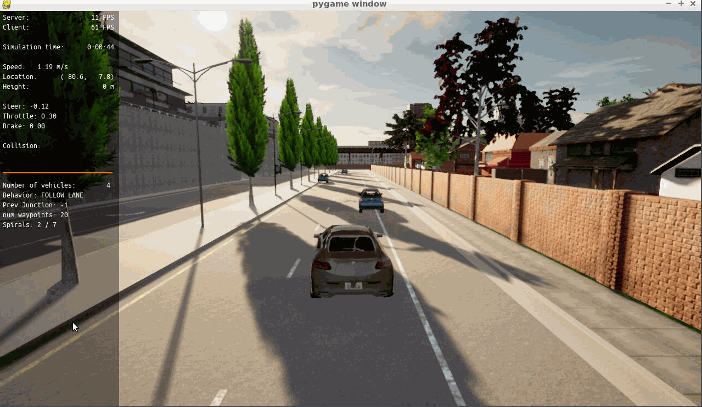

# Control and Trajectory Tracking for Autonomous Vehicle

## Table of contents
- [Proportional-Integral-Derivative (PID)](#proportional-integral-derivative-pid)
- [Installation](#installation)
- [Run Carla Simulator](#run-carla-simulator)
- [Compile and Run the Controller](#compile-and-run-the-controller)
- [Testing](#testing)
- [Report](#report)
    - [Step 1: Build the PID controller object](#step-1-build-the-pid-controller-object)
    - [Step 2: PID controller for throttle](#step-2-pid-controller-for-throttle)
    - [Step 3: PID controller for steer](#step-3-pid-controller-for-steer)
    - [Step 4: Evaluate the PID efficiency](#step-4-evaluate-the-pid-efficiency)

# Proportional-Integral-Derivative (PID)

In this project, you will apply the skills you have acquired in this course to design a PID controller to perform vehicle trajectory tracking. Given a trajectory as an array of locations, and a simulation environment, you will design and code a PID controller and test its efficiency on the CARLA simulator used in the industry.

## Installation

Run the following commands to install the starter code in the Udacity Workspace:

Clone the <a href="https://github.com/udacity/nd013-c6-control-starter/tree/master" target="_blank">repository</a>:

`git clone https://github.com/udacity/nd013-c6-control-starter.git`

## Run Carla Simulator

Open new window

* `su - student`
// Will say permission denied, ignore and continue
* `cd /opt/carla-simulator/`
* `SDL_VIDEODRIVER=offscreen ./CarlaUE4.sh -opengl`

## Compile and Run the Controller

Open new window

* `cd nd013-c6-control-starter/project`
* `./install-ubuntu.sh`
* `cd pid_controller/`
* `rm -rf rpclib`
* `git clone https://github.com/rpclib/rpclib.git`
* `cmake .`
* `make` (This last command compiles your c++ code, run it after every change in your code)

## Testing

To test your installation run the following commands.

* `cd nd013-c6-control-starter/project`
* `./run_main_pid.sh`
This will silently fail `ctrl + C` to stop
* `./run_main_pid.sh` (again)
Go to desktop mode to see CARLA

If error bind is already in use, or address already being used

* `ps -aux | grep carla`
* `kill id`


## Project Instructions

In the previous project you built a path planner for the autonomous vehicle. Now you will build the steer and throttle controller so that the car follows the trajectory.

You will design and run the a PID controller as described in the previous course.

In the directory [/pid_controller](https://github.com/udacity/nd013-c6-control-starter/tree/master/project/pid_controller)  you will find the files [pid_controller.cpp](https://github.com/udacity/nd013-c6-control-starter/blob/master/project/pid_controller/pid_controller.cpp)  and [pid_controller.h](https://github.com/udacity/nd013-c6-control-starter/blob/master/project/pid_controller/pid_controller.h). This is where you will code your pid controller.
The function pid is called in [main.cpp](https://github.com/udacity/nd013-c6-control-starter/blob/master/project/pid_controller/main.cpp).


## REPORT
### Step 1: Build the PID controller object
As the control was not instantiated, in the first step, it is not expected the car movement. Follows a screenshot of the simulator, Figure 1.
<figure>

<figcaption align = "center">Figure 1. Simulator screenshot.</figcaption>
</figure>

### Step 2: PID controller for throttle
In this step, the throttle control was instantiated, as follows (the parameters are the final tunning):
```cpp
PID pid_throttle = PID();
pid_throttle.Init(0.15,0.001,0.019, 1, -1);
```
Notice that the output of the controller is inside [-1, 1].

The speed error was computed as the difference between the actual speed and the desired speed, as follows: 
```c++
error_throttle = v_points[v_points.size()-1] - velocity;
```
Notice that the desired speed is the last point of **v_points** array.


### Step 3: PID controller for steer
In this step, the steer control was instantiated, as follows (the parameters are the final tunning):
```cpp
PID pid_steer = PID();
pid_steer.Init(0.4, 0.0012,0.8, 1.2, -1.2);
```
Notice that the output of the controller is inside [-1.2, 1.2].

The orientation error is computed as the difference between the car's actual orientation, `yaw`, and the desired orientation, `yaw_desired`. Follows the code snipped:  
```c++
double yaw_desired;
yaw_desired = angle_between_points(x_points[0], y_points[0], x_points[x_points.size()-1], y_points[y_points.size()-1]);
error_steer = yaw_desired - yaw;
```
The desired orientation is computed as the angle between the `x` axis and the straight line that passes by the desired position. Figure 2 illustrates the approach.
<figure>

<figcaption align = "center">Figure 2. Orientation error.</figcaption>
</figure>

### Step 4: Evaluate the PID efficiency
The values of the error and the pid command are saved in steer_data.txt and thottle_data.txt, and shown in Figures 3 and 4, respectively.


Questions:
- **Add the plots to your report and explain them (describe what you see)**
It is possible to see that the control outputs have the same wave shape as the steering and throttle errors. This is expected as the control output is a function of error. Notice that throttle error remains large, and the throttle output remains smaller than saturation. On the other hand, the steering control almost follows the desired orientation.

- **What is the effect of the PID according to the plots, how each part of the PID affects the control command?**
The proportional part is responsible to drives the output to the reference. The derivative is a reative part, resposible for detect variations in the reference. Finaly, the integration part is responsible for reducing the steady state error, which clearly was not effective for throttle control.

- **How would you design a way to automatically tune the PID parameters?**
PID parameters optimization could be performed using the twiddle algorithm, which is based on making iterative changes in the PID parameters based on total error observation. The magnitude of changes can be dynamically changed for fine-tuning.


- **PID controller is a model free controller, i.e. it does not use a model of the car. Could you explain the pros and cons of this type of controller?**
Its model-free characteristic has a pro, as suggested, of being not necessary to model the system dynamically, being necessary only to tune its gains. In addition, its implementation is simpler compared to other approaches. The problem with linear PID control is that some nonlinearities of the system are not taken into account, being hard to tune its parameters and in some cases almost impossible to achieve good performance.


- **(Optional) What would you do to improve the PID controller?**
A possible improvement is to add a model cancelation approach, also called feedback linearization control. In this approach, the model nonlinearities are canceled (in the ideal case), then, the PID control can be applied to a linear system.


<table style="border-style:hidden">
<tr style="border-style:hidden">
  <td style="border-style:hidden">
    
    <figcaption align = "center">Figure 3.1. Steering control output and steering error.</figcaption>
  </td>
  <td>
    
    <figcaption align = "center">Figure 3.2. Actual and desired orientations.</figcaption>
  </td>
</tr>
<tr style="border-style:hidden">
  <td colspan="2" style="border-style:hidden"><figcaption align = "center">Figure 3. Steering control.</figcaption></td>
</tr>
</table>

<table style="border-style:hidden">
<tr style="border-style:hidden">
  <td style="border-style:hidden">
    
    <figcaption align = "center">Figure 4.1. Throttle control output and throttle error.</figcaption>
  </td>
  <td>
    
    <figcaption align = "center">Figure 4.4. Actual and desired velocities.</figcaption>
  </td>
</tr>
<tr style="border-style:hidden">
  <td colspan="2" style="border-style:hidden"><figcaption align = "center">Figure 4. Throttle control.</figcaption></td>
</tr>
</table>



<figcaption align = "center">Figure 5. Animation illustrating the vehicle trajectory.</figcaption>
</figure>

